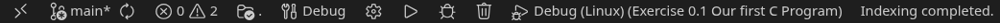

# Exercise 0.1 - Our first C Program

This exercise will demonstrate how exercises will work going forward and as a way for you to test out your setup.

## Assignment
We want to write a simple program. Open [source/main.c](source/main.c), this is where you will be writing your code.

In line 5, there is a call to the function `printf`. This prints out a message onto the console. Into the double quotes, type:
```
Hello World!\n
```
*Make sure to copy this exactly!*

Secondly, make sure the program returns 0 (to do this, simply replace -1 with 0).

Your final program should look something like this:

```c
#include <stdio.h>

int main () {
    printf("Hello World!\n");
    return 0;
}
```

To run it, simply press F5 or go to Run > Start Debugging!

### Note for VS Code
Make sure you are using the correct task before running the program with F5. In the bottom bar, you should see this:

Click on `Debug (Linux) (Exercise 0.1 Our first C Program)` to configure what task to run. There are two options:
- `Debug (Linux) (Exercise 0.1 Our first C Program)` - For Linux
- `Debug (MSYS2) (Exercise 0.1 Our first C Program)` - For Windows using MSYS2

## Tests
Every exercise will come with a tester program that will test your implementation and checks if it works correctly. It will run multiple tests, give you a feedback on each one and then a final score.

To test it out, navigate to the `tests` folder and run the executable that fits you.
- If you use WSL or Linux, run `tests/linux`.
- If you use Windows with MSYS2, run `tests/windows_msys2.exe`.
- If you use Windows with Visual Studio, run `tests/windows_vs.exe`.

### If you get 100%... Congrats, you've done it!